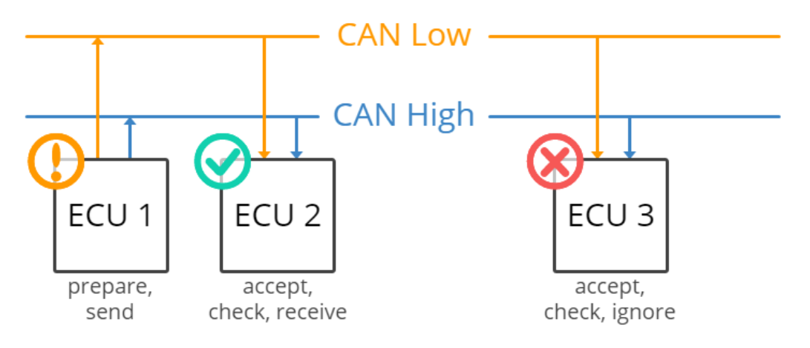
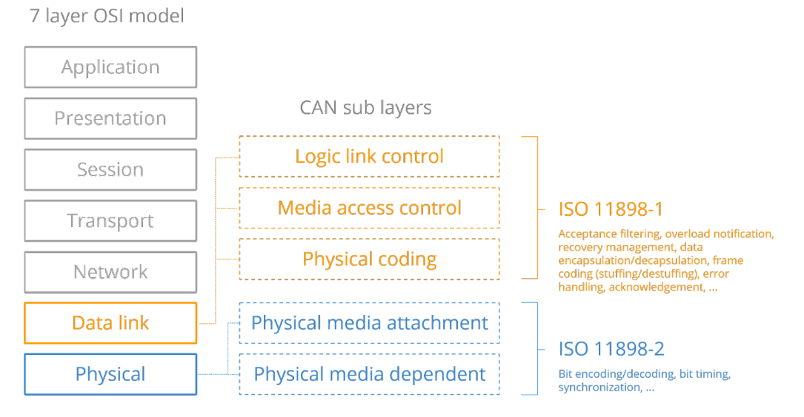
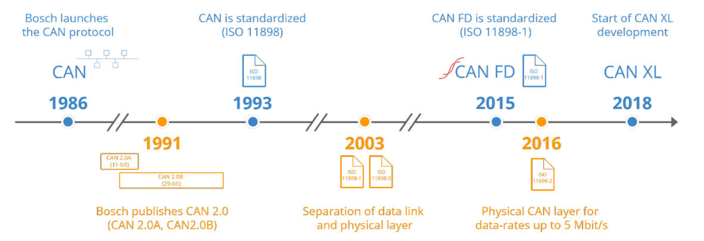
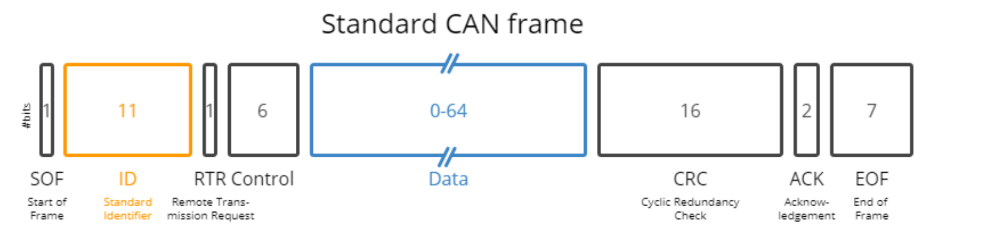

# CAN协议

## CAN总线定义

### 定义

一直都说，CAN总线是汽车上最重要的总线接口之一。那么，CAN总线是什么呢？

&gt; 什么是CAN总线?

你的汽车就像一个人的身体:控制器区域网络(CAN总线)是神经系统，实现通信。反过来，“节点”或“电子控制单元”(ecu)就像身体的一部分，通过CAN总线相互连接。一部分感知到的信息可以与另一部分共享。

&gt; 什么是ECU

在汽车CAN总线系统中，ECU可以是发动机控制单元、安全气囊、音响系统等。一辆现代汽车可能有多个ECU，每个ECU都有可能需要与其他网络部分共享的信息。

这就是CAN标准排得上用场的地方：
- CAN总线可以连接多个ECU，并进行通信
- 使用双绞线，无复杂的专用布线，网络拓展性强
- 支持仲裁和抢占，以及可以报告错误帧
- 支持一对一和一对多通信

### OSI网络

用更专业的术语来说，CAN(controller area network)是由数据链路层和物理层来描述，在高速CAN中，`ISO 11898-1` 描述了数据链路层，`ISO 11898-2` 描述了物理层，如图所示，CAN的作用经常出现在7层OSI中。

CAN总线物理层定义了电路类型、电信号水平、节点要求、电缆阻抗等。例如：`ISO 11898-2`规定了许多事情，包括以下内容
- 波特率： CAN节点必须使用两根绞线相连，经典CAN最高可以达到1Mbps，CANFD数据域最高可以达到5Mbps
- 电缆长度： 最大的长度可以达到 500米（125Kbps）或者40米（1Mbps）
- 终端： CAN总线两端必须都正确的使用120欧姆终端电阻

### 高速CAN

在汽车总线的定义中，会经常遇到不同类型的网络：下面我们提供一个简单的概述：

- 高速CAN总线： 本文的重点是高速CAN总线(ISO 11898)。它是迄今为止物理层最流行的CAN标准协议，波特率支持从40Kbps到1Mbps。只需要简单的双绞线，就可以满足简单的汽车应用。还可以作为OBD，J1939，NMEA 2000，CANOpen等高层协议的基础。第二代CAN被称为CANFD，数据域可以最高支持5Mbps。
- 低速CAN总线： 该标准支持的波特率较低，为40Kbps到125Kbps，且可以允许在两条总线出现故障之后，继续进行通信。因此，也被称为&#34;容错CAN&#34;。
- LIN总线： LIN总线是CAN总线的低成本补充，其只需要3根线就可以完成通信，可以进行更加简单的布线和更经济的网络。
- 以太网： 当今随着新能源的崛起，车辆功能越来越复杂。新能源车辆以支持ADAS(高级驾驶辅助系统)、信息娱乐系统、摄像头等高带宽要求。与CAN总线相比，汽车以太网提供了更高的数据传入速率，但缺乏经典CAN和CAN FD的一些安全/性能的特征。未来一段时间，CAN、CAN FD、CAN XL和以太网基友可能同事应用于新的汽车和工业开发。

### CAN总线优点

由于CAN总线具有以下优点，CAN总线标准几乎用于所有车辆和许多场景。

&gt; 简单，低成本

ECU可以通过单个CAN系统进行通信，而不使用更加复杂的模拟信号总线，从而减少了错误、复杂、布线、成本。

&gt; 集中

CAN总线提供了与所有ECU网络通信的入口点，且不分主从，可以进行双向通信，从而实现中央诊断、数据记录和配置。

&gt; 健壮

该系统对电气干扰和电磁干扰具有鲁棒性，是安全关键应用的理想选择

&gt; 高效

CAN具有仲裁性，数据报文可以按照ID确定优先级，以便最高优先级的数据得到立即总线访问，而不会导致其他帧的中断。

### CAN 历史

短暂介绍 `CAN总线` 的历史：
- `Pre CAN` :  汽车ECU依赖与复杂的点对点总线协议 
- 1986: 博世开发了CAN协议作为一个解决方案
- 1991: 博世发布了CAN2.0，分为CAN 2.0 A(标准帧，11bit)和CAN 2.0 B(扩展帧，29bit)
- 1993: CAN 被采纳为国际标准， ISO 11898
- 2003: ISO11898 变为标准服务
- 2012: 博世发布CANFD 1.0版本，加入了可变数据速率
- 2015: CANFD协议被标准化，ISO11898-1
- 2016: CAN物理层传输速率变为最大5Mbps，ISO11898-2
- 2018: 开始CAN XL开发

### CAN总线的未来

&gt; 展望未来，CAN总线协议将保持相关性。

尽管CAN总线还受到以下主要趋势的影响：

- 对日益先进的车辆功能需求
- 云计算兴起
- 物联网（IOT）和联网汽车的增长
- 自动驾驶汽车的影响

特别是互联汽车(V2X)和云计算的兴起，将导致汽车远程信息处理和`IOT CAN记录仪` 的快速增长。反过来，使CAN总线网络“在线”，也会使得车辆面临一些安全风险，并且可能需要转向新的CAN协议，例如：CAN FD。

### CANFD 
&gt; CAN FD 的定义

### CAN FD 的兴起

随着车辆功能的扩展，CAN总线的负载也在增加。为了支持这一点，CAN FD 被设计为“下一代”CAN总线。与经典CAN相比，CAN FD 提供了三个好处：

- 支持最高 `8M bps` 的数据域可变速率
- 数据域最多支持64个字节传输
- 通过身份验证提供了安全性

简而言之，CAN FD 提高了速度和效率，因此在交心的车辆中得到了推广。同样，这也会对 IOT CAN FD 数据记录器的需求日益增加。

## CAN 报文定义

### 什么是CAN报文定义

&gt; CAN总线上的 通信是通过CAN报文来定义，通常也会称为CAN报文。

下图是CAN标准帧(CAN 2.0 A)的位定义，其中包括11bit的标识符(ID)，可以满足大多数汽车使用。扩展帧(CAN 2.0 B)除了标识符更长，达到了29bit，并且EXT需要置为显性电平，其余都和标准帧保持一致。

各个段的定义和作用如下；

| 起始位 | 结束位 | 长度 | 定义 | 作用     | 注意         |
| ------ | ------ | ---- | ---- | -------- | ------------ |
| 0      | 0      | 1    | SOF  | 起始帧位 | 始终为 1     |
| 1      | 11     | 11   | ID   | 标识符   | 扩展帧为29位 |
| 12     | 12     | 1    | RTR  | 远程帧   |              |
| 13     | 18     | 6    | CTRL | 控制     |              |
| 19     | 84     | 64   | DATA | 数据域   |              |
| 85     | 100    | 16   | CRC  | 校验码   |              |
| 101    | 102    | 2    | ACK  | 回应字   |              |
| 103    | 109    | 7    | EOF  | 结束帧   |              |

{{&lt; admonition warning &#34;警告&#34; &gt;}}
ID: CAN 报文发送报文时，是需要获取仲裁权的。`ID` 数值越小，优先级越高。

控制位：包括 `IDE` 和 `DLC`，用来指定扩展帧位和字节长度(0~8)。
{{&lt; /admonition &gt;}}

---

> 作者: [liyuhang](https://github.com/yuhanglee)  
> URL: https://yuhanglee.github.io/posts/can-protocol/  

