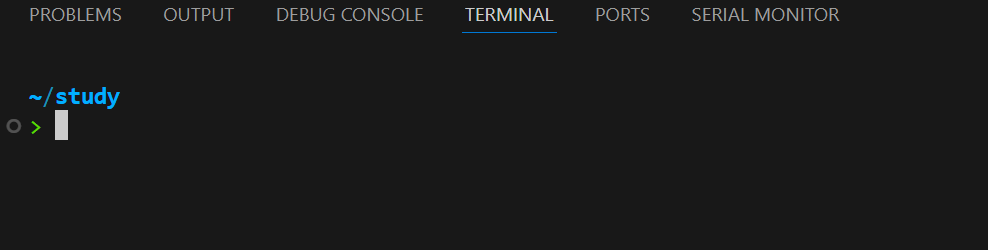

# Zephyr教程-环境配置


{{&lt; admonition quote &#34;quote&#34; false &gt;}}
zephyr 是一个类 Linux 的开发方式， 其工程由 Linux 基金会管理。
{{&lt; /admonition &gt;}}

&lt;!--more--&gt;

1. Zephyr 项目介绍
Zephyr项目是一个Linux基金会托管的协作项目，一个开源合作项目，联合了业内领先企业，为所有资源受限设备构建了针对资源受限设备进行优化的最佳小型可扩展实时操作系统（RTOS）。

&gt; Zephyr 主页
&gt; [zephyrproject-rtos/zephyr:](https://github.com/zephyrproject-rtos/zephyr)
&gt; Zephyr 官网
&gt; [docs.zephyrproject.org](https://docs.zephyrproject.org)


2. 安装 Ubuntu 环境

Ubuntu安装可以分为两种方式：物理机与虚拟机。
物理机安装：在电脑硬盘上重新安装一个新的 Ubuntu 镜像，每次开机可以选择是否启动 Ubuntu 系统。
虚拟机安装：在 Windows 系统中，安装 Vmware 软件，由软件虚拟出一个“电脑”，安装 Ubuntu ，可以和 Windows 同时启动。

我们选择第二种，使用虚拟机的方式，安装 [Ubuntu Server 24.04 LTS](https://cn.ubuntu.com/download/server/step1)。 安装教程，可以参考 [VMware安装ubuntu-24.04-live-server服务版超详细教程_ubuntu 24.04 live server-CSDN博客](https://blog.csdn.net/qingzhumuqingfeng/article/details/144011787)

由于 Ubuntu Server 没有界面，所以我选择使用 VS Code 的 SSH 插件，在 Windows 上进行开发。

&gt; VS Code 配置
&gt; 1)  VS Code 插件库内搜索 《Remote - SSH》并安装。
&gt; 2)  按下 Ctrl&#43;Shift&#43;P 选择  Remote-SSH， 并填写 Ubuntu 的 IP 地址、用户名、密码。
&gt; 
&gt; 
&gt; 3)  打开终端窗口，就可以看到已经进入 Ubuntu 系统了。
&gt; 

3. 配置 Zephyr 环境

可以参考 [docs.zephyrproject.org](https://docs.zephyrproject.org) 的官方教程，或者按照下面命令依次安装。
``` shell
# 安装 Zephyr 所依赖的本地环境和软件
sudo apt install cmake python3 device-tree-compiler 

# 检查软件是否已经安装成功
cmake --version
python3 --version
dtc --version

# 安装 python 虚拟环境
pip3 install virtualenv
pip3 install virtualenvwrapper

# 创建虚拟环境配置保存目录，并设置环境变量
mkdir $HOME/.virtualenvs

sudo vim ~/.zshrc
export WORKON_HOME=$HOME/.virtualenvs 
export VIRTUALENVWRAPPER_PYTHON=/usr/bin/python3.10 # 根据你的Python路径修改 
source /usr/local/bin/virtualenvwrapper.sh # 路径根据virtualenvwrapper 安装路径修改

# 创建虚拟环境，并指定 python 版本
mkvirtualenv -p /usr/bin/python3 env_zephyr

# 激活虚拟环境
workon env_zephyr

# 使用 pip 安装 west 构建软件，后续用来编译 Zephyr 工程
pip install west

# 初始化 Zephyr 工作目录
west init ~/zephyrproject
cd ~/zephyrproject
# 更新软件
west update

# 指定编译器方式有两种： 使用 Zephyr 指定的版本，自定义编译器版本
# 1. 使用 Zephyr 指定版本
# 如果没有 .zephyrrc 则需要自己创建
vim ~/.zephyrrc 
export ZEPHYR_TOOLCHAIN_VARIANT=zephyr

# 2. 如果使用 ARM 芯片，可以手动指定 gnu arm，以及指定工具链路径

vim ~/.zephyrrc
export ZEPHYR_TOOLCHAIN_VARIANT=gnuarmemb
export GNUARMEMB_TOOLCHAIN_PATH=/usr/arm-none-eabi  #  执行本地的 arm-none-eabi 路径，该路径下有 bin 文件夹

# 如果使用 west build 编译报错找不到 ninja，则需要安装 ninja 环境。
apt install ninja-build
# ninja --verion 


# 全部更新完成之后的软件列表如下：
&gt; ls
bootloader  modules  tools  zephyr
```

4. 测试编译速度

在 `~/zephyrproject` 路径下，执行 `time west build -b stm32f103_mini zephyr/samples/hello_world --build-dir build/stm32f103_mini`。

``` shell
# 进入 zephyr 工作目录
&gt; cd ~/zephyrproject

# 切换 python 虚拟环境，如果之前已经进入，则不需要这个步骤。
# 一般会有报错： 无法找到 west 软件
&gt; workon env_zephyr

# -b : 执行控制器
# zephyr/samples/hello_world  需要编译的应用
# --build-dir build/stm32f103_mini  指定编译结果保存路径 也可以使用 -d build/stm32f103_mini
&gt; time west build -b stm32f103_mini zephyr/samples/hello_world --build-dir build/stm32f103_mini

# 编译正常完成。共用时 20.921 秒
[135/135] Linking C executable zephyr/zephyr.elf
Memory region         Used Size  Region Size  %age Used
           FLASH:       12854 B       256 KB      4.90%
             RAM:        4160 B        48 KB      8.46%
        IDT_LIST:          0 GB        32 KB      0.00%
Generating files from /home/liyuhang/zephyrproject/build/stm32f103_mini/zephyr/zephyr.elf for board: stm32f103_mini
west build -b stm32f103_mini zephyr/samples/hello_world --build-dir   35.57s user 15.28s system 243% cpu 20.921 total
```

至此，Zephyr 基础环境配置工作已经完成。


---

> 作者:   
> URL: https://yuhanglee.github.io/posts/e3e350c/  

