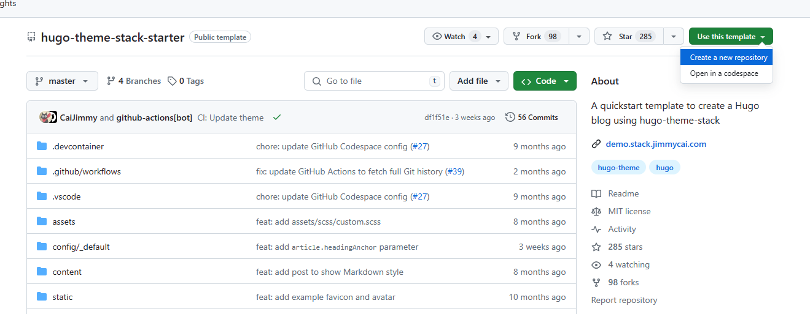
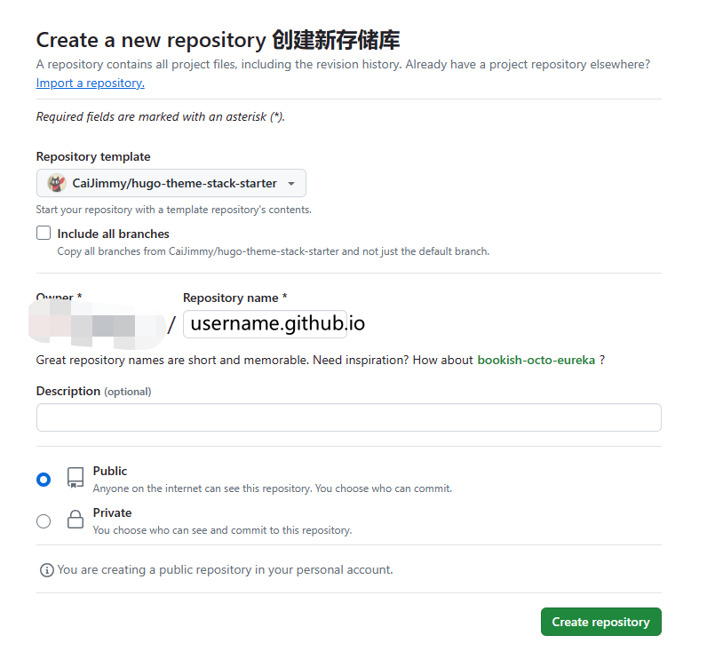
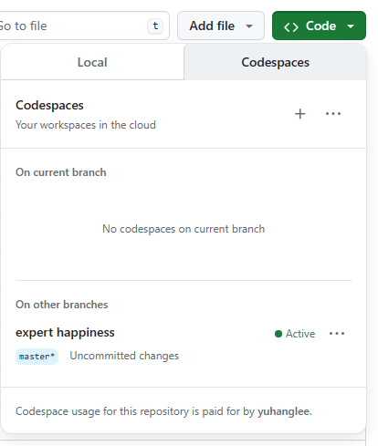
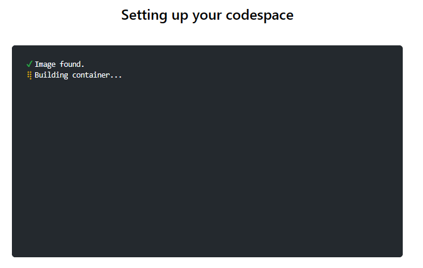
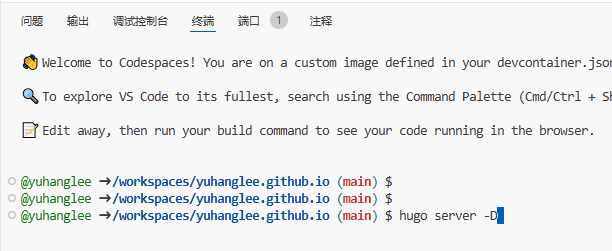
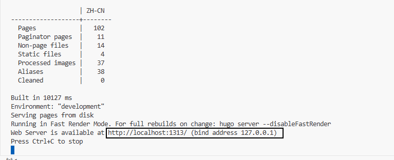
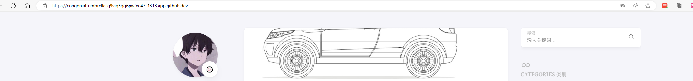
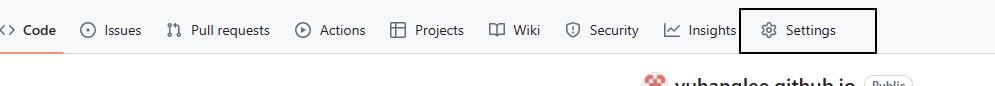
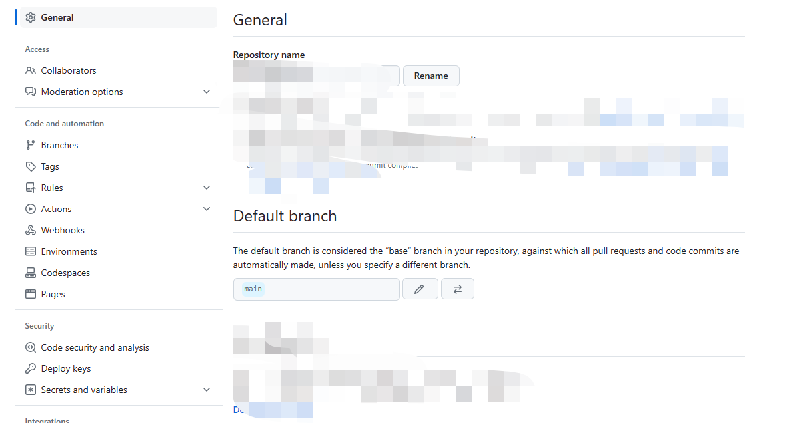
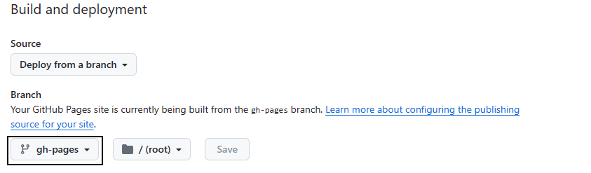

# Hugo Start


本博客是由hugo构建的，使用的主题为 `stack`。下面介绍一个比较方便的使用 `hugo` &#43; `stack` &#43; `github page` 来构建属于自己的博客。

可以参考 [hugo-stack开始指南](https://github.com/CaiJimmy/hugo-theme-stack-starter)来执行构建过程。
下面我简单复刻一下过程，并对我认为需要注意的地方进行标注。


- 使用 `hugo-stack-starter` 仓库作为模板，来创建当前仓库.




- 修改配置文件，并启动本地服务

使用 `git clone github.com/username/username.github.io.git`，将项目克隆到本地执行。需要注意的是，如果想要在本地执行的话，则需要配置hugo环境和安装 `stack` 主题。

&gt; 可以使用另一种方式查看当前的项目页面。
在当前仓库内，点击 `code` -&gt; `Codespaces` -&gt; `&#43;` ，添加一个对应的代码空间。该空间是一个云端，由github提供。

等待进度加载完成。加载过程中是在构建hugo环境和下载对应的组件及主题。



进度完成之后，执行 `hugo serve -D` 即可开启远端服务。


使用 `CTRL按键` &#43; `鼠标` 点击 `localhost:1313`，就可以打开网页。欣赏自己的第一个博客。



- 配置自动构建工具和分支。
当然，有可能打开页面之后，还是显示 `hugo-stack` 主题页面，那是因为我们还没有完成项目相关配置，也是新手比较容易踩坑的地方。

1. 配置 `config.yaml` 文件。
按照 `hugo-stack-starter` 的 `readme.md` 文件中第四条，需要修改 `config/_default/config.toml` 文件中的内容。该文件名称也可能为 `config/_default/config.yaml` 注意语法即可。

```
baseurl: https://username.github.io/
languageCode: zh-cn
theme: stack
paginate: 10
title: my blog

# Change it to your Disqus shortname before using
disqusShortname: stack
```


2. 修改主分支名称
主分支默认名称为 `master`，这里需要修改。参考一下步骤：
1) 修改 `.github/workflows/deploy.yml` 文件内容，将master修改为main
```
on:
    push:
        branches: [main]
    pull_request:
        branches: [main]
```

2) 修改仓库的主分支名称
依次点击仓库的 `Settings` -&gt; `General` -&gt; `Default branch` ，就可以看到当前默认分支名称为 `master`，需要修改为 `main`。



至于为啥不能使用 `master`，暂时我也不是很清楚原因。等找到原因之后，再补充吧。

3. 选择博客用于展示的分支

依次点击 `Settings` -&gt; `Pages` -&gt; `Branch`，修改需要构建和部署的分支，选择 `gh-pages`。



至此，博客部署就完成了，后续只需按时提交自己的内容即可。  恭祝大家有一个优秀的体验。


---

> 作者: [liyuhang](https://github.com/yuhanglee)  
> URL: https://yuhanglee.github.io/posts/hugo-start/  

